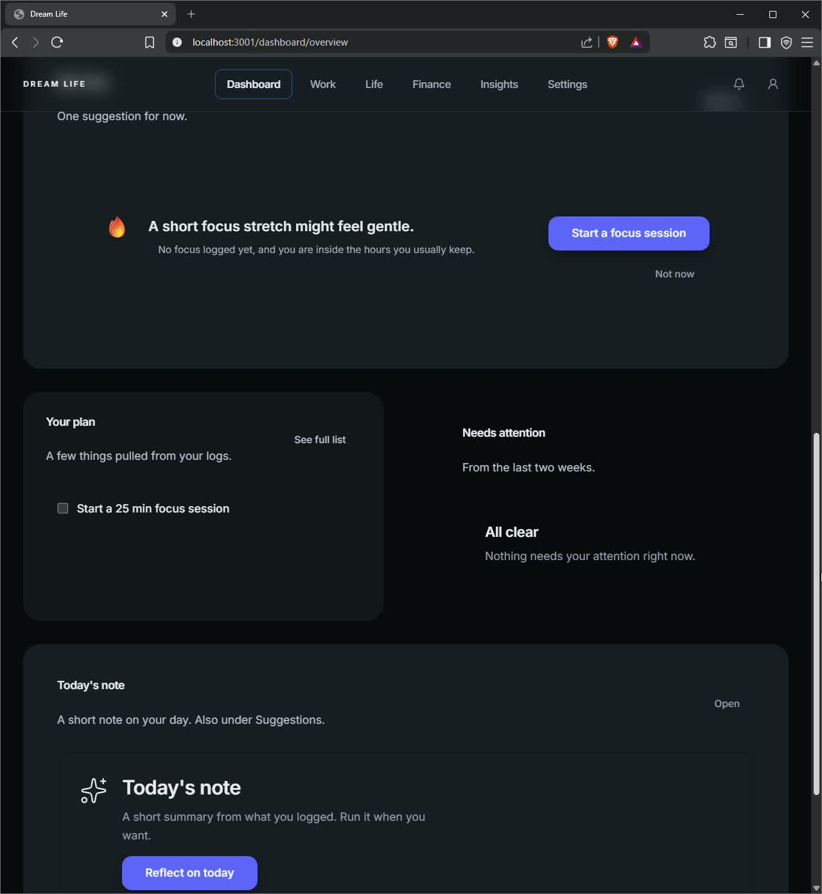
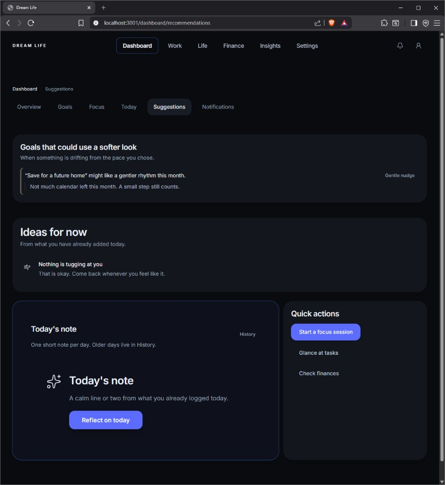
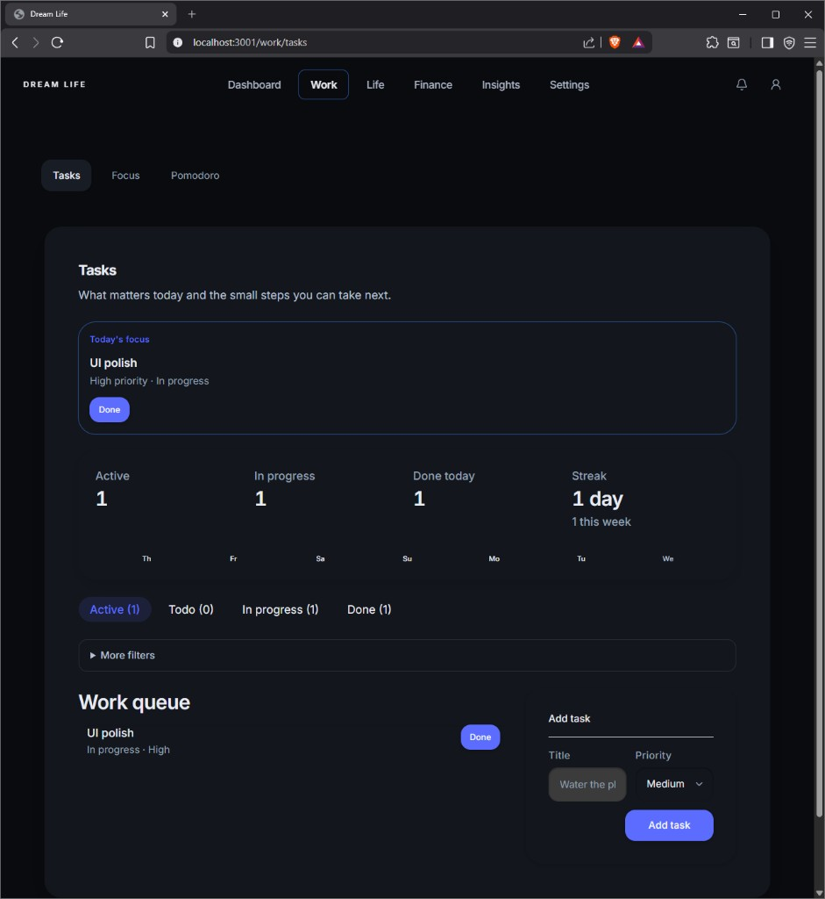
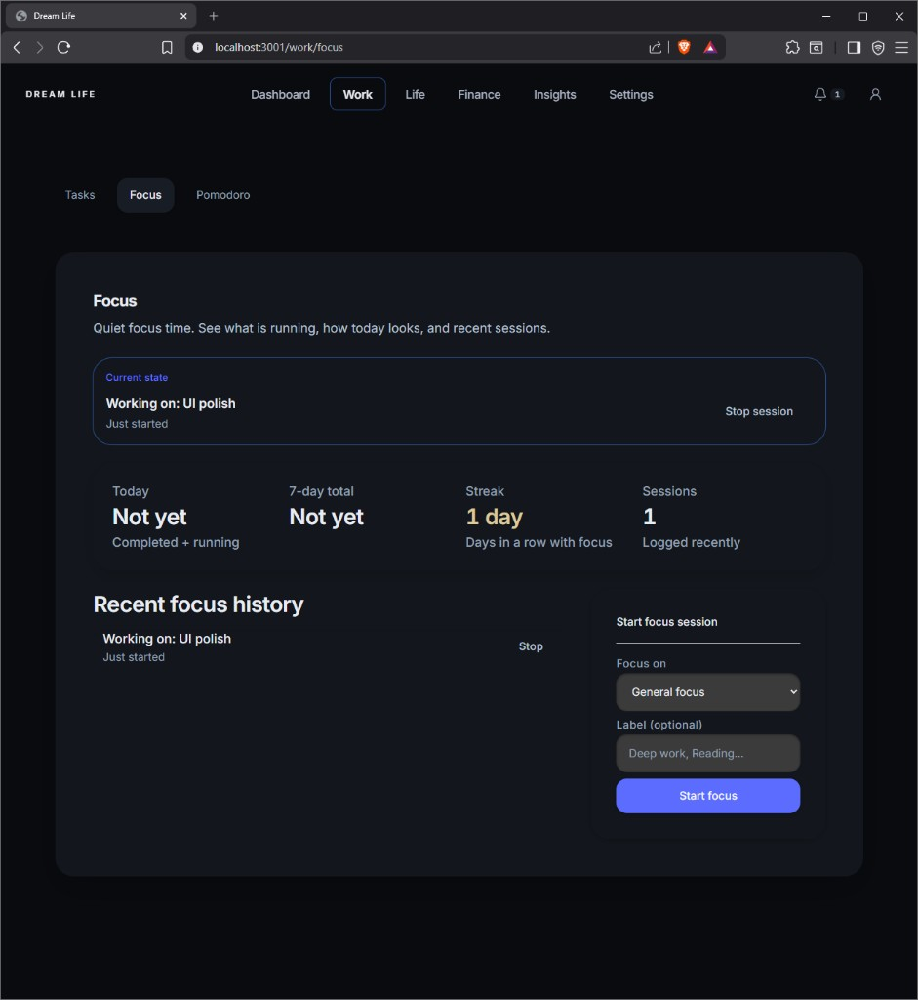
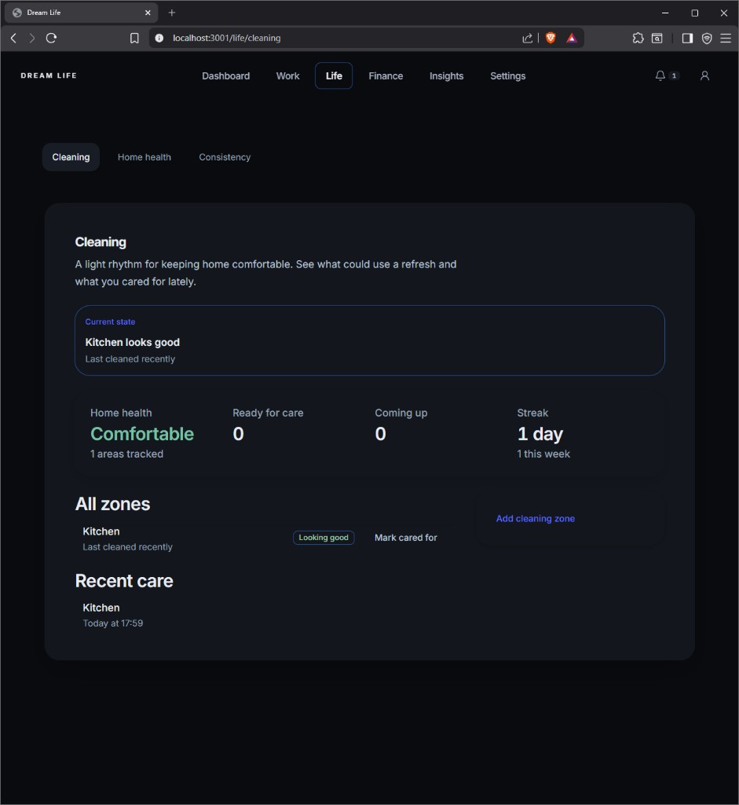
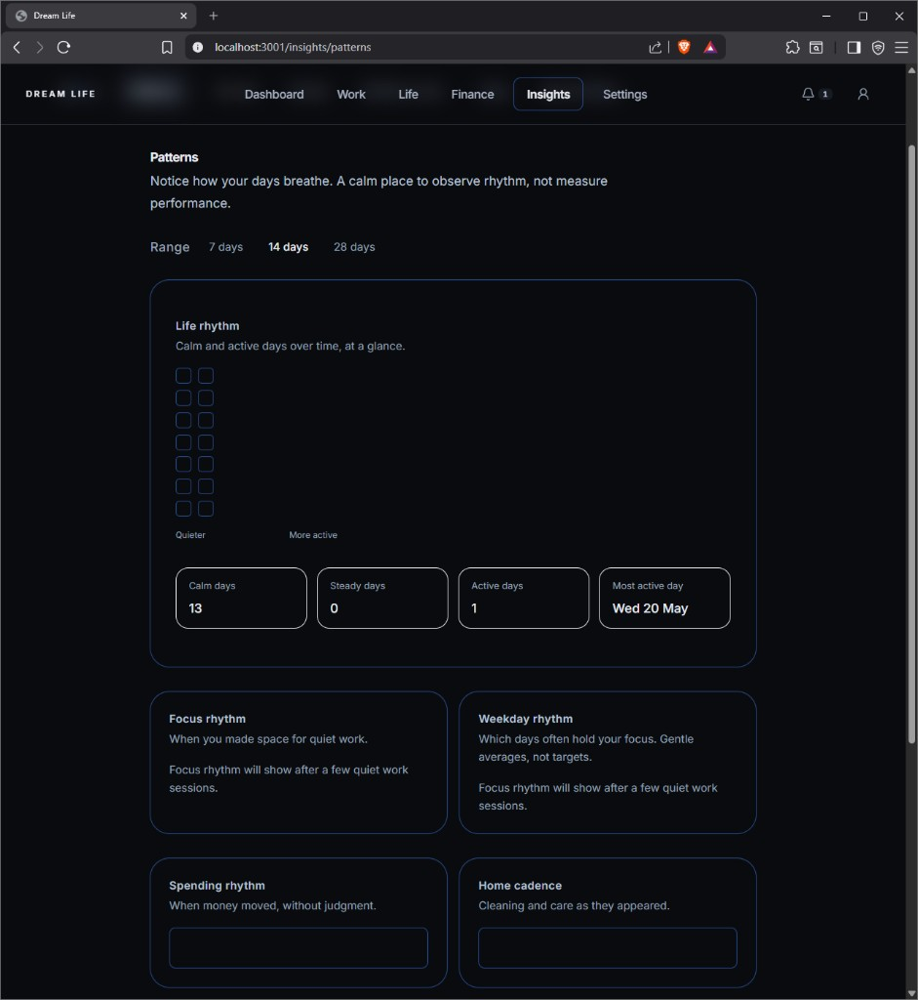

# Dream Life

A calm personal system for moving toward the life you want — through small daily steps.

Track focus, home care, money, and reflections without turning life into a performance dashboard. The product name in the UI is **Dream Life**; the repository folder is still **Life OS** in places.

<p align="center">
  
</p>

<p align="center">
  <em>Dark, quiet UI built for reflection — not hustle metrics.</em>
</p>

---

## At a glance

| Area | What you do there |
|------|-------------------|
| **Dashboard** | Overview, goals, daily plan, gentle suggestions, notifications |
| **Work** | Tasks, focus sessions, Pomodoro |
| **Life** | Cleaning zones, home health, consistency |
| **Finance** | Income & expenses, soft spending awareness |
| **Insights** | Activity, patterns, life flow, weekly & monthly reviews |
| **Settings** | Theme, language (EN / FI / RU), personalization, long-term direction |

Activity is stored as a stream of **events** in PostgreSQL, so reviews and patterns stay tied to what actually happened.

---

## Demo video

A full screen walkthrough lives locally at [`docs/Dream_life_demo.mp4`](docs/Dream_life_demo.mp4) (not committed to git — the file is large). To share publicly, upload it to **GitHub Releases**, YouTube, or similar and link it here.

---

## App tour

### Dashboard — Suggestions

Gentle nudges on goals, ideas for now, a daily reflection note, and quick actions (focus, tasks, finance).



---

### Work — Tasks

Today’s focus, light stats, and a simple queue — priorities without clutter.



---

### Work — Focus

See what is running, start or stop a session, and browse recent focus history.



---

### Life — Cleaning

Home zones, “last cared for” rhythm, streaks, and calm status copy (“Kitchen looks good”).



---

### Insights — Patterns

A contribution-style rhythm grid, day summaries, and soft charts for focus, spending, and home care.



---

### Insights — Weekly review

Work, home, and money in one calm weekly snapshot — with gentle observations, not scores.


---

## Philosophy

Dream Life is **not** a productivity app.

It should feel **calm**, **supportive**, **reflective**, and **emotionally lightweight**. The goal is not optimization — it is helping you move gently toward a long-term direction.

---

## Design principles

- Calm dark UI (light and system themes supported)
- Minimal visual noise
- No aggressive gamification
- Reflection over performance
- Human copy — not dashboard jargon

---

## Tech stack

| Layer | Technology |
| ----- | ---------- |
| Frontend | Next.js 14, React 18, TypeScript, Tailwind CSS |
| UI | Shared Life OS design tokens, accessible components |
| Backend | FastAPI, SQLAlchemy, Alembic |
| Database | PostgreSQL |
| Realtime | SSE (`/events/stream`) for live refetch |
| AI (optional) | OpenAI for insights/reviews; rule-based fallback |

**Browser:** theme, locale, personalization, automation toggles.  
**Server:** tasks, events, finance, cleaning, goals, reviews.

---

## Resetting demo data

**Settings → Developer tools**

- **Clear app history** — removes logged activity; keeps goals, tasks, and home zones.
- **Reset all data** — also removes goals, tasks, and cleaning zones. Theme, language, and preferences stay.

---

## Status

Active development — evolving toward a calm “life operating system.”

---

## Getting started

### Prerequisites

- Docker (PostgreSQL)
- Python 3.11+
- Node.js 18+

### 1. Database

```bash
docker compose up -d
```

PostgreSQL on host port **5433** by default.

### 2. Backend

```bash
cd backend
python -m venv .venv
```

Activate the venv, then:

```bash
pip install -r requirements.txt
cp .env.example .env   # Windows: copy .env.example .env
python -m alembic upgrade head
python -m uvicorn app.main:app --reload --host 0.0.0.0 --port 8765
```

- API: `http://127.0.0.1:8765/docs`
- Health: `http://127.0.0.1:8765/health`

### 3. Frontend

```bash
cd frontend
npm install
npm run dev
```

Open **`http://localhost:3001`**. Dev proxy: `/life-os-api` → port `8765`.

```powershell
# Optional override
$env:NEXT_PUBLIC_API_URL = "http://127.0.0.1:8765"
```

Restart `npm run dev` after changing `NEXT_PUBLIC_*`.

### Optional AI

In `backend/.env`:

- `AI_PROVIDER=rule_based` (default)
- `AI_PROVIDER=openai` + `OPENAI_API_KEY`

### Tests

```bash
cd backend
pytest
```

---

## Repository layout

```
Life OS/
├── backend/           # FastAPI, Alembic, tests
├── frontend/          # Next.js (Dream Life UI)
├── docs/
│   ├── images/        # README screenshots
│   └── Dream_life_demo.mp4   # local only (gitignored)
└── docker-compose.yml
```

---

## Future plans

- Onboarding
- Mobile-friendly layouts
- Richer reflections
- Optional hosted demo video link

---

## License

No license file yet. Add one if you publish or fork the project.
